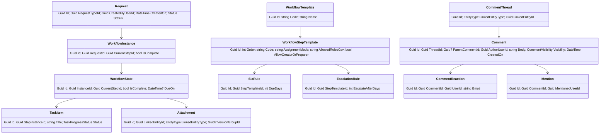
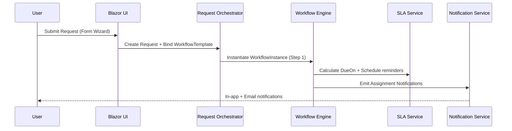

# EO Requests Tool — System Architecture

**Stack:** ASP.NET Core (.NET 8 LTS), Blazor Server + MVC (hybrid), SQL Server 2019+, EF Core, SignalR, Hangfire, OpenIddict (SSO), Serilog, SMTP, IIS on Windows Server 2022

**Environments:** DEV → UAT → PROD (IIS sites per env, separate SQL DBs, feature flags via appsettings)

---

## 1) High‑Level Overview

- **Presentation Layer**: Blazor Server UI (interactive forms, wizards), MVC endpoints for APIs and admin screens.
- **Application Layer**: Request Orchestrator, Workflow Engine, Task Service, Notification Service, Attachment Service, SLA/Escalation Service, Access Control Service.
- **Domain Layer**: Entities (Request, Workflow, Step, Task, Attachment…), Value Objects, Domain Events.
- **Infrastructure Layer**: EF Core DbContexts, Repositories, OpenIddict (SSO/RBAC), Hangfire (jobs), SignalR (real-time), Serilog (logging), SMTP (email), File Storage.

---

## 2) Component Diagram

```mermaid
flowchart TB
  subgraph Client[EO Staff & Reviewers]
    B(Desktop Browser)
  end

  B -->|HTTPS/SSO| W[IIS + ASP.NET Core (Blazor Server + MVC)]

  subgraph App[Application Layer]
    RO[Request Orchestrator]
    WF[Workflow Engine]
    TS[Task Service]
    CS[Comment & Collaboration Service]
    NS[Notification Service]
    AS[Attachment Service]
    AC[Access Control Service]
    SLA[SLA/Escalation Service]
  end

  W --> RO
  RO --> WF
  RO --> TS
  RO --> AS
  RO --> AC
  RO --> CS
  WF --> SLA
  WF --> AC
  TS --> NS
  CS --> NS
  RO --> NS

  subgraph Infra[Infrastructure]
    DB[(SQL Server)]
    HG[Hangfire Jobs]
    SG[SignalR Hub]
    SSO[OpenIddict (AuthN/AuthZ)]
    SMTP[SMTP Relay]
    FS[(File Storage)]
    LG[Serilog Sinks]
  end

  W <-->|Auth| SSO
  W <-->|Real-time| SG
  App <--> DB
  AS <--> FS
  NS --> SMTP
  SLA --> HG
  W --> LG
```


---

## 3) Key Modules & Responsibilities

### 3.1 Presentation Layer
- **Blazor Server UI**: Dynamic form wizard (JSON-schema driven), conditional fields, role/user-based visibility, inline task panel, step comments (chat), threaded discussions with reply levels (2–3 levels max for clarity), @mention tagging with notifications, activity timeline, dashboards.
- **MVC**: REST-style endpoints for admin config, file streaming (inline preview), webhook-style callbacks.

### 3.2 Application Layer
- **Request Orchestrator**
  - Creates request instances from templates; binds selected workflow; handles submit/recall/close.
- **Workflow Engine**
  - Executes step rules, branching/skip conditions, and transitions.
  - Assignment modes: `RoleBased`, `SelectedByPreviousStep` (person pick), `AutoAssign` (creator/last submitter).
  - Maintains `WorkflowState` and emits domain events.
- **Task Service**
  - Step tasks/subtasks, dependencies (gating), progress status, reminders; observers.
- **Comment & Collaboration Service**
  - Threaded comments per entity (Request, WorkflowState/Step, TaskItem).
  - **@mentions** with user picker; writes `Mention` records and triggers notifications.
  - **Visibility modes**: `Internal` (staff-only) vs `RequesterVisible` (submitter + authorized roles).
  - **Threading**: 2–3 levels (reply-to-comment) with collapse/expand; prevent infinite depth.
  - **Reactions** (👍, ✅) optional for lightweight acks; stored as `CommentReaction`.
  - **Edit/Delete policy**: short edit window (e.g., 10–15 min), deletions are soft with audit.
  - **Moderation**: role-based delete/hide; anti-spam throttle.
- **Notification Service**
  - In-app via SignalR, email via SMTP; templates via Razor; user preferences.
- **Attachment Service**
  - Drag/drop uploads, metadata, versioning, inline viewer, soft delete + purge (Hangfire).
- **SLA/Escalation Service**
  - Due date calc, reminders, escalation chains; job scheduling (Hangfire).
- **Access Control Service**
  - Evaluates permissions per action: by role, by specific assignee, or by creator/preparer flags.

### 3.3 Domain Layer (Core Entities)
- `Request` / `RequestType`
- `WorkflowTemplate`, `WorkflowStepTemplate`, `WorkflowInstance`, `WorkflowState`
- `TaskItem`, `TaskReminder`
- `CommentThread`, `Comment`, `CommentReaction`, `Mention`, `CommentVisibility`
- `Attachment` (+ version group), `EntityObserver`, `EntityRelation`
- `SlaRule`, `EscalationRule`
- `Notification`, `ActivityLog`
- Enums: `EntityType`, `WorkflowStateCode`, `TaskProgressStatus`, `AssignmentMode`, `CommentVisibility`

### 3.4 Infrastructure
- **Auth**: OpenIddict; role claims + user-specific step permissions.
- **Data**: EF Core DbContext, migrations, read-optimized views for dashboards.
- **Real-time**: SignalR hubs for notifications and live step/task updates.
- **Jobs**: Hangfire dashboard (role-restricted), scheduled reminders, purge, sync jobs.
- **Logging/Monitoring**: Serilog (file/SQL/Seq), health checks, App Insights (optional).
- **Storage**: File system or UNC share (with anti-virus scan hook), size/type validation.

---

## 4) Data Model (High-Level)




---

## 5) Security & Permissions
- **SSO** via **existing OpenIddict Authorization Server** at `https://user-auth.unece.org`.
  - OIDC client apps (DEV/UAT/PROD) registered with exact `redirect_uri` (CallbackPath, e.g., `/signin-oidc`) and `post_logout_redirect_uri`.
  - Cookie auth for app session; OIDC challenge for sign-in.
- **Authorization** combines:
  - Role membership (claims `role`/`roles`) issued by OpenIddict **plus** DB-sourced roles appended at sign-in.
  - Specific user assignee (from `SelectedByPreviousStep`).
  - Flags: `AllowCreatorOrPreparer`.
- **Data scoping**: Users see requests they created, are assigned to, or have role-based access; admins see all.
- **Audit**: EntityActivityLog for create/update/status/assignment actions; immutable history.
- **Files**: Antivirus scan hook; quotas; download vs inline view permissions.

### 5.1 OIDC Integration Notes (App-side)
- OIDC scopes: `openid profile email roles`.
- Map claims: `name`, `email`, `role`/`roles`.
- Append DB roles on `OnTokenValidated` (or via `IClaimsTransformation`) and **cache** them to avoid per-request DB hits.
- Support single logout:
  - App triggers end-session at `https://user-auth.unece.org/auth/logout`.
  - Include `post_logout_redirect_uri` back to the app.
- Harden validation: enforce `ValidateIssuer`, `ValidIssuer`, and `RequireHttpsMetadata`.
- Store app secrets outside appsettings (user-secrets/KeyVault); per-env client IDs.

---

## 6) Background Jobs (Hangfire)
- SLA reminders (T-3, T-1), escalations (T+1, T+3)
- Daily digest emails
- Attachment purge (soft-delete → 90 days → hard delete)
- External syncs (e.g., staff directory, lookups)
- **Outbox dispatcher**: deliver buffered domain events (SignalR/email) reliably with retries (Idempotent Job Keys)

---

## 7) Real-Time & Notifications
- **SignalR** hub broadcasts: assignment, status change, **new comment/reply**, task updates, **mention pings**.
- Notification center in navbar; toasts; email fallback with Razor templates.
- **Unread counters** per entity and per thread; batch marking as read when user views.
- **Digest emails** (Hangfire): daily/weekly roll-ups of open tasks, overdue SLAs, and comment mentions.

---

## 8) Admin & Configuration
- Workflow designer: create templates, steps, branching conditions, SLA rules.
- Form designer: JSON schema for dynamic fields, validators, conditional visibility.
- Permission matrix per step: roles + specific user assignment mode.
- Lookup vocabularies shared across modules.
- **Comments policy** per RequestType: default visibility (Internal/RequesterVisible), edit window minutes, max reply depth (2–3), reactions enabled (on/off), mentionable roles/groups.

---

## 9) Deployment & Ops
- IIS sites per environment; reverse proxy (optional); HTTPS only.
- CI/CD: build → run tests → migrate DB → deploy; blue/green or slot-based when possible.
- Backups: full nightly + log shipping; test restores monthly.
- Observability: health checks, structured logs, dashboards for request throughput/SLA.
- **SignalR scale-out**: Redis backplane when multi-node.
- **Performance budgets**: p95 < 200ms reads, < 500ms writes; alerting on regressions.
- **Rate limiting** on comments/uploads; anti-abuse throttles.

---

## 10) Example Sequence (Submit → Assign → Notify)



---

## 11) Tech Choices & Rationale
- **Blazor Server** for rich, stateful UI with minimal JS; MVC for APIs and admin.
- **EF Core** for rapid iteration + migrations; read models for dashboards.
- **SignalR** for real-time collaboration.
- **Hangfire** for robust, retryable background jobs with dashboard.
- **OpenIddict** to align with existing SSO model and role claims.
- **Serilog** for structured logs and easy correlation.

---

## 12) Roadmap Hooks
- Phase 2: AI-assisted triage, Teams notifications, mobile-friendly push, BPMN import/export.
- Phase 3: Cross-division workflows, external submissions (partner SSO), analytics warehouse.

---

## 14) MVP Scope (Phase 0)
**Goal:** Ship a usable vertical slice for two request types with governance, audit, and basic reporting.

**Included:**
- Request types: **Consultant Request**, **ICT Support**
- Workflow engine with: Role-based + Selected-by-previous-step assignment, branching, skip rules
- Dynamic form wizard from JSON schema (+ validation, conditional fields)
- Step tasks (gating), basic dependencies, task attachments
- Comments: 2-level threads, @mentions, internal vs requester-visible
- Notifications: in-app + email templates (submission, assignment, mentions)
- SLA: due-date calc + reminders; single-step escalation
- Attachments: upload, metadata, inline viewer; soft delete
- Access control: role checks + creator/preparer flags; OIDC (OpenIddict) SSO
- Dashboards: My Requests, My Actions, SLA status; CSV export
- Audit: EntityActivityLog; basic timeline UI
- Ops: Hangfire dashboard (restricted), Serilog + health checks

**Excluded (deferred):** workflow version migration UI, multi-tenant org calendars, analytics warehouse, Teams integration.

**Definition of Done:** p95 latency targets met; zero Critical/High security findings; restore drill passed; UAT sign-off by process owners (Finance ICT).

---

## 15) Phase 1 — Enterprise Hardening & Admin UX
- **Workflow versioning**: `WorkflowTemplateVersion`; new vs in-flight handling; clone/deprecate actions
- **Outbox pattern** for events (already added jobs) + idempotent handlers
- **Optimistic concurrency**: rowversion on Request/WorkflowState/TaskItem; conflict prompts in UI
- **Search & Reporting**: indexed filters, saved searches; SLA breach rate, cycle time; export API
- **SLA calendars**: business hours + holidays per org unit
- **Admin matrices**: Step × Role/User permission matrix; comment policy controls
- **i18n/accessibility**: EN/FR resources; WCAG 2.1 AA checks

---

## 16) Phase 2 — Integrations & Insights
- **Teams notifications** and actionable cards (webhook/HMAC)
- **Directory-backed mentions** using Staffing API (cached)
- **Advanced analytics**: warehouse-friendly read models; Power BI templates
- **Mobile quality**: push-friendly notification endpoints; offline-friendly comment composer
- **BPMN import/export** (subset) for template bootstrap

---

## 17) Security, Privacy & Compliance Checklist
- Data protection: TDE, optional column encryption for sensitive fields
- File security: AV scan hook; file-type allow list; watermarking for sensitive downloads
- Audit hardening: append-only logs with hash chaining (tamper-evident); Audit Viewer
- Secrets: Key Vault/DPAPI; periodic rotation; per-env OIDC clients
- Policy store: named authorization policies referenced by step rules (avoid raw role strings)

---

## 13) Commenting & Mentions — Design Decisions
- **Thread depth**: limit to **2 levels** (comment + reply). Additional replies reference parent with quote preview.
- **Editor**: safe Markdown subset (bold/italic, code, quote, list) + paste-to-attach; strip scripts; sanitize HTML.
- **Mentions**: `@name` autocomplete from staff directory; store `Mention` rows for delivery & audit.
- **Visibility**: `Internal` comments hidden from requesters; `RequesterVisible` shown to submitter + authorized roles; per-step default.
- **Moderation**: Admins/process owners can hide/restore; original text retained in audit log.
- **Reactions**: lightweight acknowledgment (👍, ✅) reduces noise and replaces "+1" replies.
- **Performance**: server-side paging on long threads; lazy-load older replies; SignalR for live updates.
- **Access control**: only assignees/owners can comment when step is "Pending Action"; requesters can comment when waiting-for-info.

---

**Ready to proceed**: The architecture now includes MVP scope, phased roadmap, and enterprise hardening patterns (versioning, outbox, concurrency, scale-out, security), keeping us aligned with the BRD and standard enterprise platforms.
